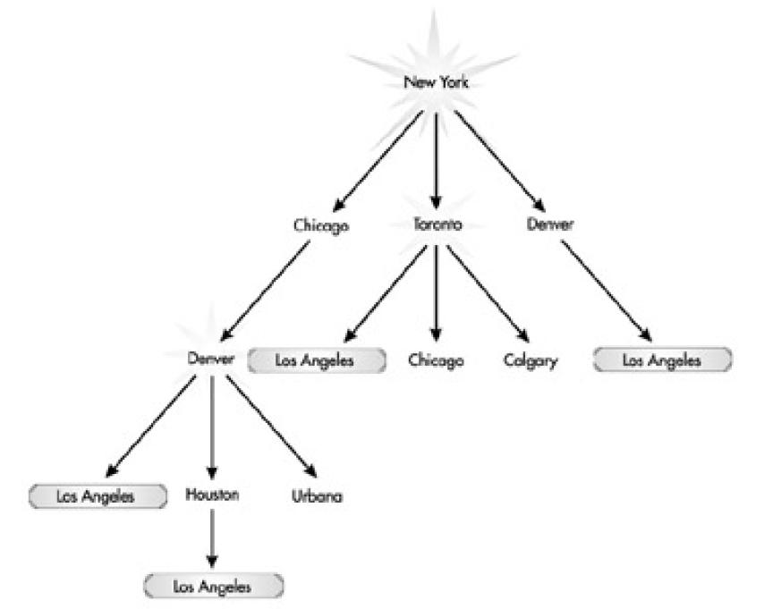

## Breadth-First Search (BFS) Algorithmus

Der BFS-Algorithmus kommt vor allem zum Einsatz bei der Suche nach dem kürzesten Pfad in einem 
gerichteten Graphen.

Eine (empfehlenswerte) Beschreibung gibt Willial Fiset in

https://www.youtube.com/watch?v=oDqjPvD54Ss (7 Minuten).

Implementieren Sie den BFS-Algorithmus in einer Klasse `BFSGraph`. Verwenden Sie geeignet in dieser Klasse
die Vorarbeiten der beiden Klassen `Edge` und `Graph`.

##### Bezug zur STL:

Folgende Elemente der STL können Anwendung finden:

###### Container:

`std::vector<>`, `std::deque<>`, `std::list<>`, `std::initializer_list`

###### Iteratoren:

`std::vector<int>::iterator`, `std::vector<int>::reverse_iterator`, `std::back_inserter`

###### Algorithmen:

`std::for_each`, `std::reverse`, `std::fill`, `std::generate`, `std::begin`, `std::end`, `std::tuple_size`

## Test der Realisierung:

In Abbildung 3 finden Sie eine Landkarte mit Flugverbindungen innerhalb von Nordamerika vor. Sie können unschwer erkennen,
dass es mehrere Möglichkeiten gibt, von New York nach Los Angeles zu fliegen. Berechnen Sie mit Hilfe des BFS-Algorithmus
eine Verbindung, bei der Sie am wenigsten Umsteigen müssen.

Abbildung 3: Flugverbindungen in Nordamerika.

Abbildung 4: Darstellung der Flugverbindungen in Nordamerika als gerichteter Graph (DAG).

*Bemerkung*: Die Frage nach der kürzesten Flugstrecke (also möglicherweise der ökonomischsten Flugverbindung) 
betrachten wir später.

---

[Zurück](../../Readme.md)

---

