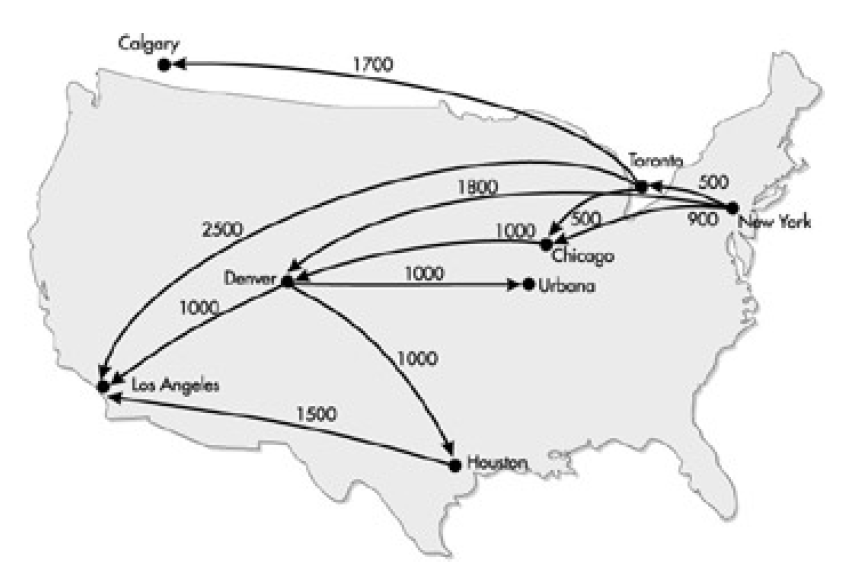
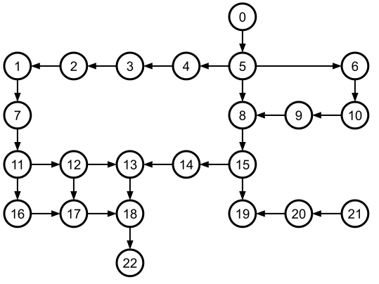

## Breadth-First Search (BFS) Algorithmus

Der BFS-Algorithmus kommt vor allem zum Einsatz bei der Suche nach dem *kürzesten* Pfad in einem 
ungewichteten (gerichteten oder ungerichteten) Graphen.

Der BFS-Algorithmus findet die kürzeste Entfernung aufgrund seines radialen Suchmusters,
das Knoten in der Reihenfolge ihrer Entfernung vom Startpunkt berücksichtigt


Eine (empfehlenswerte) Beschreibung des Algorithmus gibt *William Fiset* in

https://www.youtube.com/watch?v=oDqjPvD54Ss (7 Minuten).

Implementieren Sie den BFS-Algorithmus in einer Klasse `BFSGraph`. Verwenden Sie geeignet in dieser Klasse
die Vorarbeiten der beiden Klassen `Edge` und `Graph`.


##### Bezug zur STL:

##### Das ist aller zu überarbeiten !!!

Folgende Elemente der STL können Anwendung finden:

###### Container:

`std::vector<>`, `std::deque<>`, `std::initializer_list`

###### Iteratoren:

`std::vector<int>::iterator`, `std::vector<int>::reverse_iterator`, `std::back_inserter`

###### Algorithmen:

`std::for_each`, `std::reverse`, `std::fill`, `std::generate`, `std::begin`, `std::end`, `std::tuple_size`


## Test der Realisierung:

In *Abbildung* 1 finden Sie eine Landkarte mit Flugverbindungen innerhalb von Nordamerika vor. Sie können unschwer erkennen,
dass es mehrere Möglichkeiten gibt, von New York nach Los Angeles zu fliegen. Berechnen Sie mit Hilfe des BFS-Algorithmus
eine Verbindung, bei der Sie am wenigsten Umsteigen müssen.



*Abbildung* 1: Flugverbindungen in Nordamerika.

*Bemerkung*: Die Frage nach der kürzesten Flugstrecke (also möglicherweise der ökonomischsten Flugverbindung) 
betrachten wir später.

Beim Studium von *Abbildung* 1 können Sie folgende Städte erkennen:

  * New York
  * Toronto
  * Chicago
  * Urbana
  * Houston
  * Denver
  * Calgary
  * Los Angeles

Dabei besteht zwischen folgenden Städten eine Flugverbindung:

| Von | Nach |
| :-- | --|
| New York | Toronto |
| New York | Chicago |
| New York | Denver |
| Toronto | Chicago |
| Toronto | Calgary |
| Toronto | Los Angeles |
| Chicago | Denver |
| Houston | Los Angeles |
| Denver | Urbana |
| Denver | Houston |
| Denver | Los Angeles |

*Tabelle* 1. Flugverbindungen

#### 1. Aufgabe

Wir wollen annehmen, dass die Flugverbindungen aus *Tabelle* 2 für beide Richtungen gelten,
wir legen also einen ungerichteten Graphen zu Grunde.
Damit stellen wir die Frage: Wie kann man von New York nach Urbana fliegen,
ohne am wenigsten Umsteigen zu müssen?

---

#### 2. Aufgabe

Wir wollen annehmen, dass die Flugverbindungen aus *Tabelle* 2 nun nur für eine Richtung gelten:
Man kann also von New York nach Toronto fliegen, aber nicht von Toronto nach New York,
der zu Grunde liegende Graph muss gerichtet sein.
Damit stellen wir die Frage: Wie kann man von New York nach Urbana fliegen,
ohne am wenigsten Umsteigen zu müssen?

Wir wollen unsere Realisierung noch ein einem zweiten Beispiel testen.
Dabei wenden wir den BFS-Algorithmus sowohl auf einen ungerichteten als auch auf einen gerichteten Graphen an.

---

#### 3. Aufgabe

In *Abbildung* 2 beginnen wir mit einem Beispiel zu einem ungerichteten Beispielgraphen.
Das Beispiel orientiert sich an einem
[Online Tutorial](https://www.inf.hs-flensburg.de/lang/algorithmen/graph/breadth-first-tree.htm)
von Hans Werner Lang von der Hochschule Flensburg:


*Abbildung* 2: Beispiel für einen ungerichteten (ungewichteten) Graphen.

Auf Basis der erbrachten Vorarbeiten können wir den Graphen aus *Abbildung* 2 wie folgt
in einem C++&ndash;Programm umsetzen:

```cpp
01: UnweightedUndirectedGraphAdjListRepresentation graph{ 23 };
02:      
03: graph.addEdges({
04:     {0, 5}, {1, 2}, {2, 3}, {3, 4}, {4, 5}, {5, 6}, {1, 7}, {5, 8}, {6, 10}, {8, 9},
05:     {9, 10}, {7, 11}, {8, 15}, {11, 12}, {12, 13}, {13, 14}, {14, 15}, {11, 16},
06:     {12, 17}, {13, 18}, {15, 19}, {16, 17}, {17, 18}, {19, 20}, {20, 21}, {18, 22} 
07: });
08: 
09: std::cout << graph << std::endl;
10: 
11: size_t source{ 0 };
12: size_t target{ 22 };
13: 
14: BFSSolver<int> bfs{ graph };
15: std::vector<std::optional<size_t>> paths = bfs.solve(source);
16: std::vector<size_t> solution = bfs.reconstructPath(source, target, paths);
17: bfs.printSolution(solution);
```

Die Lösung in der Berechnung des kürzesten Pfads zwischen den beiden Knoten 0 und 22 lautet:

```
[0] => [5] => [8] => [15] => [14] => [13] => [18] => [22].
```

#### 4. Aufgabe

Wir wollen einen ähnlichen Graphen wie aus *Abbildung* 2 betrachten, nur
dieses Mal soll es sich um einen gerichteten Graphen handeln:



*Abbildung* 3: Beispiel für einen gerichteten (ungewichteten) Graphen.

Auch dieses Mal besteht die größte Arbeit ein der Eingabe des Graphen.
Wir testen das Programm an zwei Eingaben:
Der Suche nach einem Pfad zwischen den beiden Knoten 0 und 21 (den es nicht gibt)
und einer zweiten Suche zwischen 6 und 18:

```cpp
01: UnweightedDirectedGraphAdjListRepresentation graph{ 23 };
02: 
03: graph.addEdges({
04:     {0, 5}, {5, 4}, {4, 3}, {3, 2}, {2, 1}, {5, 6}, {1, 7}, {5, 8}, {6, 10}, {9, 8},
05:     {10, 9}, {7, 11}, {8, 15}, {15, 14}, {14, 13}, {11, 12}, {12, 13}, {11, 16}, {12, 17},
06:     {13, 18}, {15, 19}, {16, 17}, {17, 18}, {20, 19}, {21, 20}, {18, 22}
07: });
08: 
09: std::cout << graph << std::endl;
10: 
11: size_t source{ 6 };
12: size_t target{ 18 };
13: 
14: BFSSolver<int> bfs{ graph };
15: std::vector<std::optional<size_t>> paths = bfs.solve(source);
16: std::vector<size_t> solution = bfs.reconstructPath(source, target, paths);
17: bfs.printSolution(solution);
```

Die Lösung in der Berechnung des kürzesten Pfads zwischen den beiden Knoten 0 und 21 lautet:

```
No Solution found !
```

Der zweite Pfad ist berechenbar:

```
[6] => [10] => [9] => [8] => [15] => [14] => [13] => [18].
```

---

[Zurück](../../Readme.md)

---

