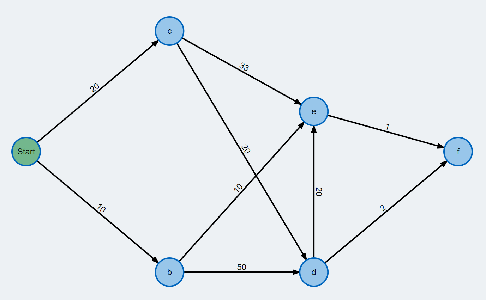
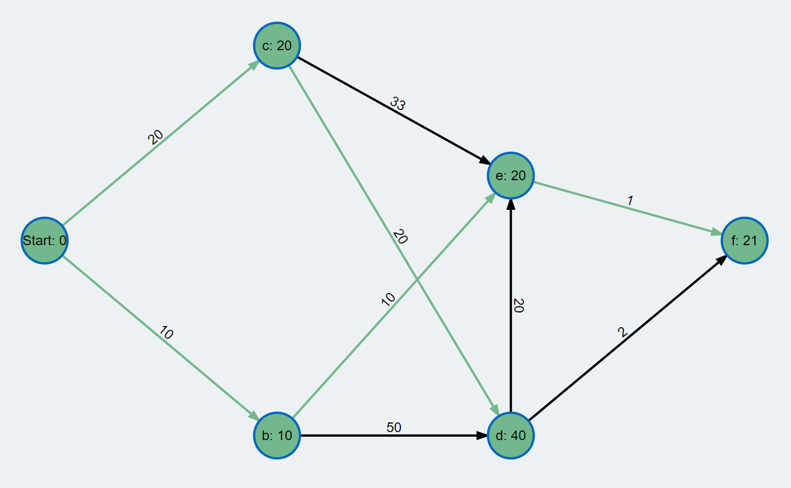
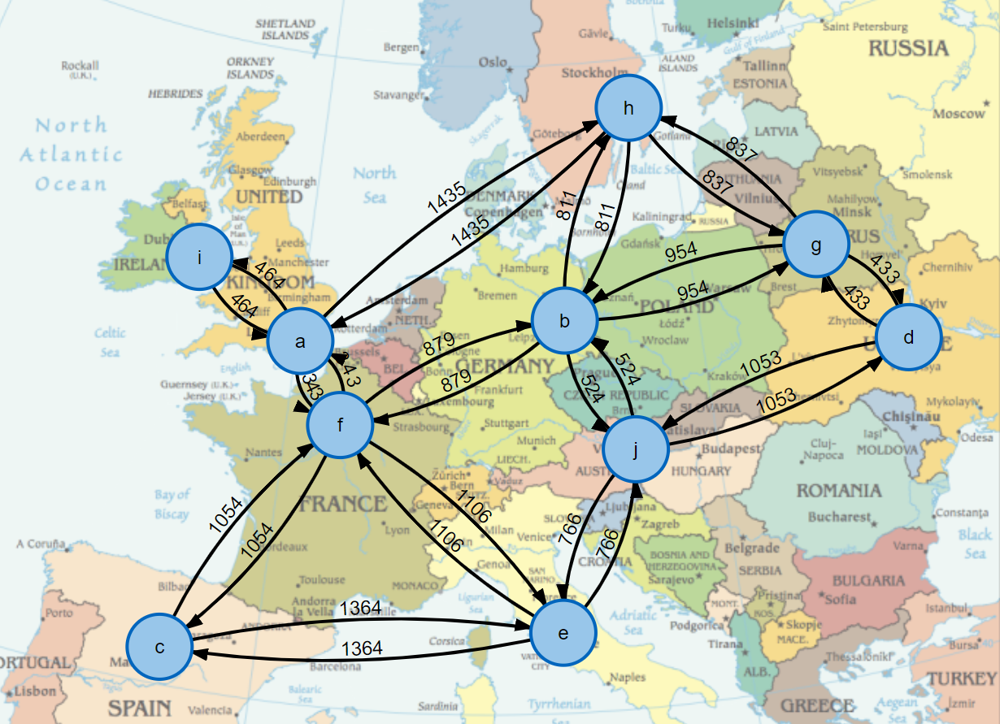
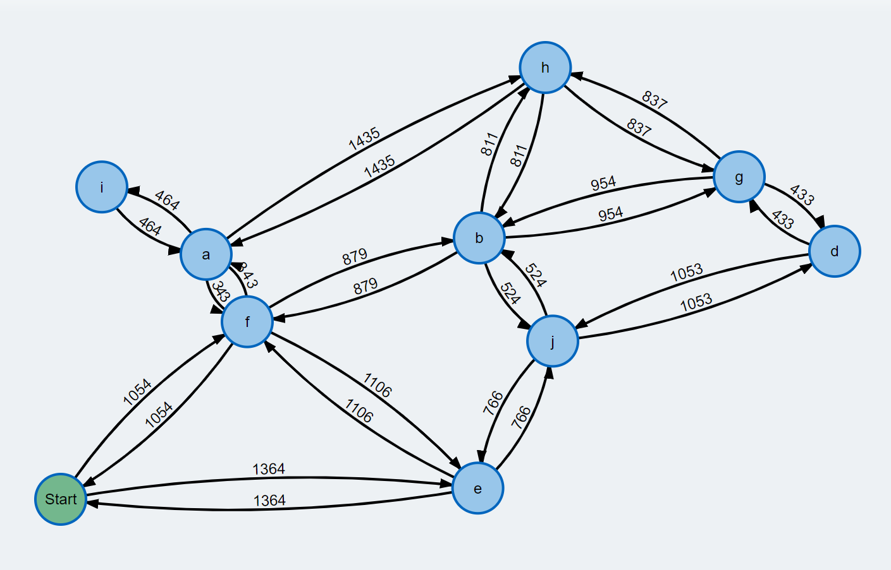
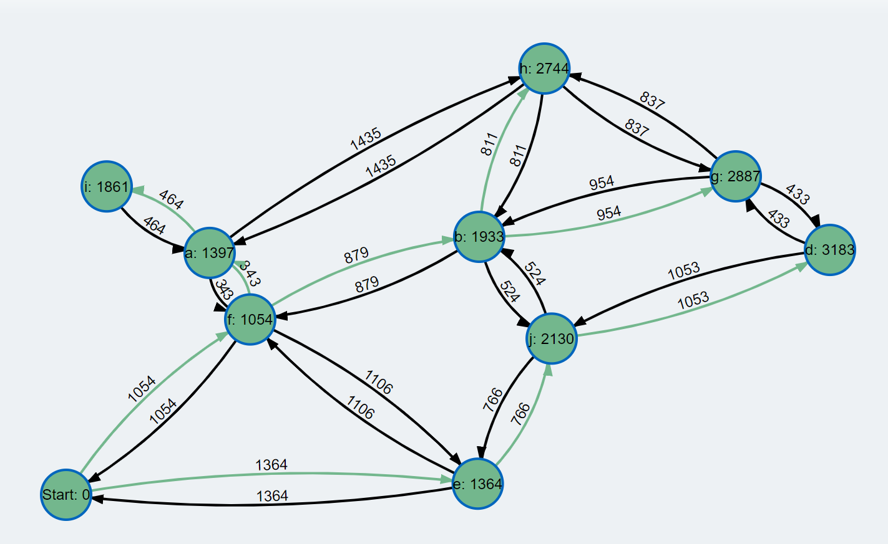

## Der Algorithmus von Dijkstra

### *Vorbemerkung*:

Es folgen zwei weitere "Klassiker" der Graphentheorie: Der Algorithmus von Dijkstra und Kruskal's Algorithmus.
Bevor wir auf die Algorithmen im Detail eingehen, erörtern wir ihre Ziele - und vor allem auch ihre Unterschiede:

  * *Algorithmus von Dijkstra*: Der Algorithmus löst das Problem der kürzesten Pfade zu einem gegebenen Startknoten.
    Er bietet sich also an, wenn Sie zu zwei Knoten den kürzestmöglichen Weg (Gewichtung der Kante: Entfernung)
    oder auf der Suche nach dem kostengünstigsten Weg sind (Gewichtung der Kante: Kosten). Um es noch einmal zu betonen:
    Das Ergebnis des Dijkstra-Algorithmus ist ein *Pfad* in einem Graphen.

  * *Algorithmus von Kruskal*: Dieser Algorithmus berechnet einen minimalen Spannbäume eines (ungerichteten) Graphen. 
    Das Ergebnis ist damit (im Gegensatz zum Dijkstra-Algorithmus) wiederum ein Graph mit der minimalen Anzahl von
    Kanten, um zu allen Knoten gelangen zu können. Dieser Algorithmus kann somit beispielsweise für einen Lieferservice
    interessant sein, um *alle* Kunden "günstigst" (Entfernung, Kosten) zu erreichen. 

### Einleitung

Der Algorithmus von Dijkstra löst das Problem des kürzesten Weges von einem gegebenen Startknoten
zu einem Zielknoten in einem kantengewichteten, gerichteten Graphen.
Der Algorithmus berechnet dabei sogar die kürzesten Wege
zu allen anderen Knoten des Graphen.

Die Arbeitsweise des Algorithmus studieren Sie am besten mit Hilfe eines Videotutorials,
meine Empfehlung hierzu:

https://www.youtube.com/watch?v=2poq1Pt32oE   (8 Minuten)

Auch William Fiset hat sich diesem Algorithmus zugewendet, seine Beschreibung ist etwas länger geraten:

https://www.youtube.com/watch?v=pSqmAO-m7Lk   (24 Minuten)

Um Ihnen die Umsetzung des Erläuterungen in ein lauffähiges Programm zu erleichtern,
finden Sie nachstehend eine Beschreibung des Algorithmus in Pseudocode-Notation vor:

```cpp
bool computeShortest(int start) {

    // need vector for distances
    // (initialize all possible distances as infinite)
    m_distances [0 .. max]: 'infinite'

    // need a priority queue
    std::priority_queue pq;

    // add start vertex to priority queue, distance is 0
    std::pair<int, int> startTrack { start , 0};
    pq.push(startTrack);

    // distance to same node is zero
    m_distances[start] = 0;

    // while priority queue isn't empty...
    while (pq not empty) {

        // get minimum distance vertex from priority queue - we call it 'vertex'
        int vertex = pq.pop();

        // get all adjacent vertices of the dequeued vertex
        for (Edge edge : neighbours) {

            int target = getTarget(edge);
            int weight = getWeight(edge);

            // if the distance to 'target' is shorter by going through 'vertex' ...
            if (m_distances[target] == std::nullopt || m_distances[target] > m_distances[vertex] + weight) {

                // update the distance of 'target'
                m_distances[target] = m_distances[vertex] + weight;

                // insert 'target' into the priority queue
                std::pair<int, int> track{ target , m_distances[target] };
                pq2.push(track);
            }
        }
    }

    return true;
}
```

##### Bezug zur STL:

Folgende Elemente der STL können Anwendung finden:

###### Container:

`std::vector<>`, `std::deque<>`, `std::list<>`, `std::initializer_list`, `std::optional`, `std::priority_queue`

###### Iteratoren:

`std::vector<int>::iterator`, `std::vector<int>::reverse_iterator`, `std::back_inserter`

###### Algorithmen:

`std::for_each`, `std::reverse`, `std::fill`, `std::generate`, `std::begin`, `std::end`, `std::tuple_size`, `std::greater`


### Test der Implementierung:

Eine weitere gute Beschreibung samt interaktiven Beispielen findet man auf der Homepage
der Technischen Universität München vor:

https://www-m9.ma.tum.de/graph-algorithms/spp-dijkstra/index_de.html

Von dieser Seite habe ich ein Beispiel zum Testen meiner Implementierung verwendet (Abbildung 6).



Abbildung 6: Testbeispiel der LMU München

Wenn Ihre Implementierung stimmt, sollten Sie die Resultate von Abbildung 7 erhalten:



Abbildung 7: Ergebnisse zum Testbeispiel der LMU München

Ein weiteres Beispiel zum Testen - ebenfalls von der Homepage der TUM - 
sind Reisen in Europa mit einem Verkehrsmittel ihrer Wahl (Abbildung 8):



Abbildung 8: Landkarte von Europa mit Entfernungsangaben.

Wählen Sie aus der Landkarte einen beliebigen Ausgangsort
und treten Sie eine Reise an einen beliebigen Zielort an.
Welches ist die kürzeste Verbindung, um gemäß den in der Karte verfügbaren Reisemöglichkeiten
das Ziel zu erreichen. Überprüfen Sie mehrere Reisen an Hand von Beispielen.



Abbildung 9: Landkarte von Europa mit Entfernungsangaben - vereinfachte Darstellung.



Abbildung 10: Ergebnisse des Algorithmus von Dijkstra bei Auswahl von Madrid als Ausgangsort.

### Lösung:

Um es vorweg zu nehmen: Die Studenten der TU München haben bei ihrer Reise durch Europa
mit Madrid als Ausgangspunkt richtig gerechnet, woran ich auch nicht mit Mindesten gezweifelt hatte :).
Der schwierigste Teil bei dieser Aufgabe besteht eigentlich darin, die Daten des Graphen richtig - und damit meine ich: ohne Tippfehler -
in ein Programm zu übernehmen.

Die Anwendung sieht in meinem Fall so aus:

```cpp
class CityDetails {
private:
    int m_number;
    std::string m_name;
    std::string m_mapId;

public:
    // c'tors
    CityDetails() : m_number(0), m_name(std::string("")), m_mapId(std::string("")) {}
    CityDetails(int number, std::string name, std::string mapId) : m_number(number), m_name(name), m_mapId(mapId) {}

    // getter
    int getNumber() const { return m_number; };
    std::string getName() const { return m_name; };
    std::string getMapId() const { return m_mapId; };
};

class RouteDetails {
private:
    std::string m_route;

public:
    // c'tors
    RouteDetails() : m_route(std::string("")) {}
    RouteDetails(std::string route) : m_route(route) {}

    // getter
    std::string getText() const { return m_route; };
};

std::ostream& operator << (std::ostream& os, const CityDetails& details) {
    os << details.getName() << " [" << details.getMapId() << "]";
    return os;
}

void test_03_Dijkstra_TUM_Europa ()
{
    // Beispiel TUM München Europakarte
    constexpr int a = 0;
    constexpr int b = 1;
    constexpr int c = 2;
    constexpr int d = 3;
    constexpr int e = 4;
    constexpr int f = 5;
    constexpr int g = 6;
    constexpr int h = 7;
    constexpr int i = 8;
    constexpr int j = 9;

    Node<CityDetails> n01{ a, {a, std::string("London"), std::string("a")} };
    Node<CityDetails> n02{ b, {b, std::string("Berlin"), std::string("b")} };
    Node<CityDetails> n03{ c, {c, std::string("Madrid"), std::string("c")} };
    Node<CityDetails> n04{ d, {d, std::string("Kiew"), std::string("d")} };
    Node<CityDetails> n05{ e, {e, std::string("Rom"), std::string("e")} };
    Node<CityDetails> n06{ f, {f, std::string("Paris"), std::string("f")} };
    Node<CityDetails> n07{ g, {g, std::string("Minsk"), std::string("g")} };
    Node<CityDetails> n08{ h, {h, std::string("Stockholm"), std::string("h")} };
    Node<CityDetails> n09{ i, {i, std::string("Dublin"), std::string("i")} };
    Node<CityDetails> n10{ j, {j, std::string("Wien"), std::string("j")} };

    WeightedEdge<int, RouteDetails> we01{ i, a, 464 , "Dublin => London" };
    WeightedEdge<int, RouteDetails> we02{ a, i, 464 , "London => Dublin" };

    WeightedEdge<int, RouteDetails> we03{ c, f, 1054 , "Madrid => Paris" };
    WeightedEdge<int, RouteDetails> we04{ f, c, 1054 , "Paris => Madrid" };

    WeightedEdge<int, RouteDetails> we05{ a, f, 343 , "London => Paris" };
    WeightedEdge<int, RouteDetails> we06{ f, a, 343 , "Paris => London" };

    WeightedEdge<int, RouteDetails> we07{ c, e, 1364 , "Madrid => Rom" };
    WeightedEdge<int, RouteDetails> we08{ e, c, 1364 , "Rom => Madrid" };

    WeightedEdge<int, RouteDetails> we09{ a, h, 1435 , "London => Stockholm" };
    WeightedEdge<int, RouteDetails> we10{ h, a, 1435 , "Stockholm => London" };

    WeightedEdge<int, RouteDetails> we11{ f, b, 879 , "Paris => Berlin" };
    WeightedEdge<int, RouteDetails> we12{ b, f, 879 , "Berlin => Paris" };

    WeightedEdge<int, RouteDetails> we13{ f, e, 1106 , "Paris => Rom" };
    WeightedEdge<int, RouteDetails> we14{ e, f, 1106 , "Rom => Paris" };

    WeightedEdge<int, RouteDetails> we15{ h, g, 837 , "Stockholm => Minsk" };
    WeightedEdge<int, RouteDetails> we16{ g, h, 837 , "Minsk => Stockholm" };

    WeightedEdge<int, RouteDetails> we17{ b, g, 954 , "Berlin => Minsk" };
    WeightedEdge<int, RouteDetails> we18{ g, b, 954 , "Minsk => Berlin" };

    WeightedEdge<int, RouteDetails> we19{ j, d, 1053 , "Wien => Kiew" };
    WeightedEdge<int, RouteDetails> we20{ d, j, 1053 , "Kiew => Wien" };

    WeightedEdge<int, RouteDetails> we21{ g, d, 433 , "Minsk => Kiew" };
    WeightedEdge<int, RouteDetails> we22{ d, g, 433 , "Kiew => Minsk" };

    WeightedEdge<int, RouteDetails> we23{ b, h, 811 , "Berlin => Stockholm" };
    WeightedEdge<int, RouteDetails> we24{ h, b, 811 , "Stockholm => Berlin" };

    WeightedEdge<int, RouteDetails> we25{ b, j, 524 , "Berlin => Wien" };
    WeightedEdge<int, RouteDetails> we26{ j, b, 524 , "Wien => Berlin" };

    WeightedEdge<int, RouteDetails> we27{ j, e, 766 , "Wien => Rom" };
    WeightedEdge<int, RouteDetails> we28{ e, j, 766 , "Rom => Wien" };

    // create graph
    GraphAdjList<Node<CityDetails>, WeightedEdge<int, RouteDetails>> graph(true);

    graph.addNodes({
        n01, n02, n03, n04, n05, n06, n07, n08, n09, n10
    });

    graph.addEdges({
        we01, we02, we03, we04, we05, we06, we07, we08, we09, we10,
        we11, we12, we13, we14, we15, we16, we17, we18, we19, we20,
        we21, we22, we23, we24, we25, we26, we27, we28
    });

    // create solver
    DijkstraSolver<Node<CityDetails>, WeightedEdge<int, RouteDetails>> dijkstra;
    dijkstra.setGraph(&graph);

    // travelling from Madrid ('c' == Madrid)
    dijkstra.computeShortestPathDijkstra(c);
    dijkstra.printShortestPath();
}
```

Nun gut, die Länge des Programms ist den vielen Daten der Landkarte geschuldet.
Die Ausgabe lautet:

```cpp
Printing the shortest paths for node 2.
Distance from Madrid [c] to London [a] is:1397
Distance from Madrid [c] to Berlin [b] is:1933
Distance from Madrid [c] to Madrid [c] is:0
Distance from Madrid [c] to Kiew [d] is:3183
Distance from Madrid [c] to Rom [e] is:1364
Distance from Madrid [c] to Paris [f] is:1054
Distance from Madrid [c] to Minsk [g] is:2887
Distance from Madrid [c] to Stockholm [h] is:2744
Distance from Madrid [c] to Dublin [i] is:1861
Distance from Madrid [c] to Wien [j] is:2130
```

---

[Zurück](Readme.md)

---
