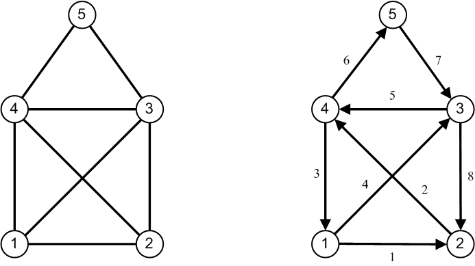

## Überlegungen zum Entwurf

#### Allgemeines

Für einen Graphen benötigt man Knoten (*Nodes*, *Vertices*) und Kanten (*Edges*).
Eine Umsetzung mit entsprechenden Klassen `Node` und `Edge` ist ein gangbarer Weg.
Bei den Kanten würde sich sogar noch eine minimalistische Klassenhierarchie mit zwei
abgeleiteten Klassen `UnweightedEdge` und `WeightedEdge` anbieten, siehe dazu Abbildung 1:


Abbildung 1: Zwei Klassen `UnweightedEdge` und `WeightedEdge`.

Der Vorschlag aus Abbildung 1 ist natürlich nur als ein erster Ansatz zu verstehen. Weitere Methoden wie etwa `getWeight`
oder die Darstellung der Objekte als Zeichenkette (`toString`) fehlen.

---

#### Knoten

In den moderneren Ausprägungen von C++ bieten sich Alternativen zu diesem Ansatz an.
Mit den Standardklassen `std::pair` und `std::tuple` lassen sich Knoten und Kanten mit erheblich weniger
Schreibaufwand (Programmierarbeit) umsetzen. Betrachten Sie dazu die folgende Definition eines Datentyps `Node`:

```cpp
template<typename T>
using Node = std::pair<int, T>;
```

Es handelt sich hierbei um ein so genanntes *Alias Template*. Um dieses verwenden zu können,
benötigt man für den Template Parameter `T` eine Klasse. Diese ist dazu gedacht,
einem realen `Node`-Objekt weitere zusätzliche Informationen wie etwa eine Knotenbeschriftung,
Ortsangaben, etc. hinzufügen zu können. Eine Node-Instanz (`std::pair`) beherbergt damit einen int-Wert,
der als Id des Knotens aufzufassen ist und ein Objekt beliebigen Typs, dass spezifische Knoten-Informationen
enthält, siehe Abbildung 2:


Abbildung 2: Klasse `Node` als Alias-Template definiert.

Diese Zusatzinformationen können von Graph zu Graph verschieden sein,
deshalb bietet sich die Gestaltung mit einem Template Parameter geradezu idealerweise an. 
Das folgende Beispiel betrachtet einen Graphen mit Flugverbindungen:

```cpp
class FlightNodeInfo {
private:
    std::string m_departure;
public:
    // c'tors
    FlightNodeInfo() = default;
    FlightNodeInfo(std::string departure) : m_departure(departure) {}

    // getter
    std::string getDeparture() const { return m_departure; };
};
```

Um nun eine Knotenklasse zu definieren, muss man das Alias Template `Node` 
mit dem Template Argument `FlightNodeInfo` instanziieren:

```cpp
Node<FlightNodeInfo> node1{ 0, { "New York"} };
```

Das Objekte `node1` wird hier mit der so genannten *Uniform Initialization* Syntax initialisiert.
verwendet. Wem diese Schreibweise zu lange ist, der könnte den Datentyp `Node<FlightNodeInfo>` wiederum mit einer `using`-Direktive
verkürzen:

```cpp
using FlightNode = Node<FlightNodeInfo>;
```

Für die Initialisierung eines Objekts vom Typ `Node<FlightNodeInfo>` (bzw. `FlightNode`)
gibt es mehrere Möglichkeiten:

```cpp
FlightNodeInfo info("Chicago");
Node<FlightNodeInfo> node2{ 0, info };

Node<FlightNodeInfo> node3 (0, FlightNodeInfo ("Chicago"));

FlightNode node4 { 0, { "Toronto"} };
```

sind nur einige weitere Beispiele einer möglichen Instanziierung des Alias Templates `Node<FlightNodeInfo>`.

Sie haben gegenüber der
herkömmlichen Vorgehensweise (*POCO*, "*Plain Old C++ Object*") einige Vorteile zu bieten:

  * Je nach Graph (gerichtet, ungerichtet) und Algorithmus (Kanten gewichtet oder ungewichtet) lassen
    sich bei der Instanziierung des Graphen die erforderlichen Kanten und Knoten mit
    entsprechenden Template-Argumenten variabel einsetzen.
  * Neben den zwingend erforderlichen Informationen der beteiligten Knoten und Kanten lassen sich optionale Informationen
    durch den Template-Mechanismus über zusätzliche Template Parameter ergänzen.

Noch weisen die vorgestellten Alias Templates für Knoten und Kanten einen Mangel auf:
Es fehlen komfortable Zugriffsfunktionen, um an Informationen "welcher Knotenindex", "welches Kantengewicht" etc.
zu gelangen. Diese lassen sich durch Funktionsschablonen hinzufügen:

```cpp
// helper functions for nodes
template<typename N>
int getId(const N& node) {
    return std::get<0>(node);
}

template<typename N, typename T>
T getDetails(const N& node) {
    return std::get<1>(node);
}
```

Da diese Funktionen zunächst einmal keinen Bezug zum korrespondierenden Alias Template des Knotens (bzw. einer Kante)
haben, sind `getId` und `getDetails` wiederum als Funktionsschablone definiert. Die konkrete Ausprägung des Alias Templates
ist folglich das Template Argument für eine Instanziierung von  `getId` und `getDetails`:

```cpp
using FlightNode = Node<FlightNodeInfo>;
Node<FlightNodeInfo> node1{ 0, { "New York"} };
int nodeIdChicago = getId(node1);
FlightNodeInfo info = getDetails<FlightNode, FlightNodeInfo>(node1);
```

Man beachte in diesem Beispiel, dass durch die so genannte *Automatic Template Argument Deduction* die
explizite Instanziierung der Funktionsschablone in manchen Situationen entfallen kann - siehe zum Beispiel den Aufruf
von `getId`. Beim Aufruf von `getDetails` hingegen kann der Übersetzer diese Auflösung nicht von selbst durchführen,
die Schablonenargumente sind explizit anzugeben ("`<FlightNode, FlightNodeInfo>`").

---

#### Kanten

Die Idee im Entwurf einer Klasse für Knoten erweitern wir mit Hilfe der C++-Standard-Klasse
`std::tuple` für Kanten. Neben zwei Ids, die für eine Kante den
Anfangs- und Endknoten beschreiben, fügen wir mit dem Template Mechanismus ein drittes Objekt hinzu,
dass für eine spezifische Anwendung Kanten detaillierter beschreiben kann:


Abbildung 3: Klasse `Edge` als Alias-Template definiert.


#### Graphen

Mit den geleisteten Vorarbeiten kommen wir nun direkt auf die Entwicklung einer Klasse `Graph` zu sprechen.
In der konkreten Realisierung einer Graphenklasse bieten sich mindestens zwei Strategien an: Mit Hilfe
einer Adjazenzliste oder einer Adjazenzmatrix. Bei sehr dünn besiedelten Graphen wiederum sind andere 
Realisierungen möglich, auf die wir aber nicht näher eingehen.


Abbildung 4: Darstellung eines gerichteten Graphen mittels Adjazenzliste.

Die Alternative zu Adjazenzlisten sind Adjazenzmatrizen. Dazu betrachten wir in Abbildung 5
zwei Graphen, die ähnlich sind: Es ist das  Haus des Nikolaus, als ungerichteter und als
gerichteter Graph dargestellt:



Abbildung 5: Das Haus des Nikolaus - als ungerichteter und gerichteter Graph dargestellt.

Bei der Umsetzung eines Graphen in eine Adjazenzmatrix ist zu beachten, ob der Graph
gerichteter und ungerichtet ist. In Abbildung 6 finden Sie eine Adjazenzmatrix des Hauses vom Nikolaus
als gerichteter Graph vor:


Abbildung 6: Adjazenzmatrix des Hauses vom Nikolaus als ungerichteter Graph.

Derselbe Graph mit gerichteten Kanten wird durch eine Adjazenzmatrix
wie in Abbildung 7 gezeigt dargestellt:


Abbildung 7: Adjazenzmatrix des Hauses vom Nikolaus als gerichteter Graph.

Man beachte die Unterschiede der beiden Adjazenzmatrizen aus Abbildung 6 und 7.

Da sich offenbar mehrere Möglichkeiten auftun, eine Klasse für einen Graphen zu realisieren,
sollte man zunächst eine *öffentliche Schnittstelle* eines Graphen definieren und diese an einer separaten Stelle fixieren.
Auf diese Weise können wir verhindern, dass die Benutzer eines Graphen keine Abhängigkeiten
zu einer konkreten Realisierung vornehmen.

Dies kann durch die Festlegung einer *Schnittstelle* (`interface`) geschehen. In C++ werden Schnittstellen
durch abstrakte Basisklassen umgesetzt, deren Methoden ausschließlich rein virtuell definiert sind (*pure virtual functions*).
Rein virtuelle Methoden besitzen keine Implementierung, diese ist von den abgeleiteten Klassen zu erbringen.
Die Schnittstelle (abstrakte Basisklasse) fungiert also eher als ein Kontrakt bzw. eine Festlegung,
welche Dienstleistungen (Methoden) eine reale Implementierung bereitstellt.

Da wir die Knoten und Kanten des Graphen als Alias Templates definiert haben,
ist die abstrakte Schnittstelle des Graphen ebenfalls als Klassen Template zu definieren, siehe Abbildung 8:


Abbildung 8: Abstrakte Basisklasse (Schnittstelle) `IGraph`.

---

#### Realisierung mit Adjazenzliste

Es ist durchaus möglich, von einer Template Klasse (abstrakt oder nicht abstrakt) zu erben.
Der Begriff *Template Vererbung* wäre an dieser Stelle zutreffend, es gelten alle üblichen Regeln
für Vererbung und Polymorphismus. Wenn die neue abgeleitete Klasse generisch sein soll - was in unserem Beispiel der Fall ist -,
muss auch sie eine Template Klasse sein.

Dabei ist darauf zu achten, dass die Template Parameter der Basisklasse an die abgeleitete Klasse
weiter gereicht werden, siehe Abbildung 9:


Abbildung 9: Beispiel einer Template Vererbung: Klasse `GraphAdjList` spezialisiert `IGraph`.

---

#### Graphen als Adjazenzmatrix

Die Realisierung einer Klasse `GraphAdjMatrix` sollte sich in identischer Weise von der Schnittstelle `IGraph` 
wie die Klasse `GraphAdjList`.

```cpp
template <typename NODE, typename EDGE>
class GraphAdjMatrix : public IGraph<NODE, EDGE> {
private:
    bool m_isDirected;
    int  m_numNodes;
    int  m_numEdges;
    std::vector<NODE> m_nodes;   // nodes vector
    std::vector<EDGE> m_adj; // adjacency matrix
```

*Hinweis*: In einem ersten Ansatz würde man in einer Klasse `GraphAdjMatrix`  für die Kanten einen Vektor vom Typ
`std::vector<std::vector<EDGE>>` erwarten. Da aus Sicht der Laufzeit
geschachtelte `std::vector`-Klassen problematisch sind, lässt sich eine Matrix - mit geringem Mehraufwand -
auch durch einen eindimensionalen `std::vector` darstellen.

---

#### Verhältnis Graph zu Algorithmus

Wir sind fast am Ziel angekommen. Die Umsetzung unterschiedlicher Algorithmen
der Graphentheorie kann sich nun auf ihre spezifischen Probleme konzentrieren;
die Realisierung des Graphen selbst (Verwaltung der Knoten und Kanten; Auskunftsfunktionen zu benachbarten Knoten, etc.)
residiert in Klassen wie `GraphAdjList` oder `GraphAdjMatrix`.

Wenn wir nun - zum Beispiel für die Tiefensuche - eine Klasse `DFSSolver` entwerfen, die natürlich ein Graphenobjekt
benötigt, müssen wir klären, in welchem Verhältnis Algorithmusobjekt und Graphenobjekt zueinander stehen!

Die Ableitung einer Algorithmusklasse (wie zum Beispiel `DFSSolver`) von einer Graphenklasse (wie zum Beispiel `GraphAdjList`)
sieht verlockend aus, wenn wir Abbildung 10 betrachten:


Abbildung 10: Graphentheoretischer Algorithmus als Spezialisierung eines Graphen.

In einer vereinfachten Darstellung betrachtend erbt eine Algorithmus-Klasse alle (`protected`) Elemente (Daten und Methoden) des Graphen,
wenn wir die öffentliche Vererbung von C++ anwenden. Bietet sich dieser Weg tatsächlich an?

Wird das Prinzip der Vererbung *sinnvoll* eingesetzt, muss die "is-a"-Relationship ("ist-ein" Beziehung) gegeben sein!
Aussagen wie "Ein Lösungsalgorithmus für die Tiefensuche (Klasse `DFSSolver`) IST-EIN Graph (Klasse `GraphAdjList`)" müssen
formulierbar sein. Dieser Satz ist auf jeden Fall so nicht richtig. Natürlich muss ein Lösungsalgorithmus an die Informationen
des Graphen gelangen. Dies entspricht aber eher der Betrachtungsweise "ein Algorithmus *kennt* einen Graphen".

Diese Beziehung setzen wir durch eine *setter*-Methode an der Algorithmus-Klasse um,
der Algorithmus gelangt in den Besitz eines Zeigers zum Graphen-Objekt und kann so auf dessen
öffentliche Schnittstelle zugreifen:


Abbildung 11: Algorithmus-Klasse *kennt* Graphen-Objekt.

Wie sind am Ende der Entwurfsbetrachtungen angelangt und können uns nun der Realisierung
graphentheoretischer Algorithmen zuwenden.

---

[Zurück](../../Readme.md)

---
