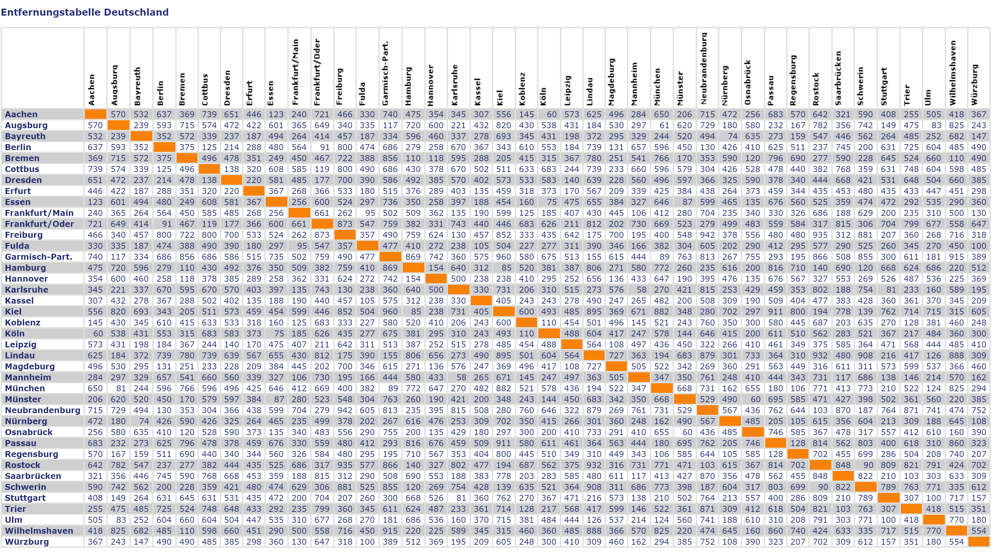

## Nearest-Neighbour Algorithmus

### Einleitung

Der Nearest-Neighbour Algorithmus („Nächster-Nachbar Algorithmus“) ist ein heuristisches Verfahren
aus der Graphentheorie und wird unter anderem zur Approximation einer Lösung des Problems des Handlungsreisenden verwendet.

### Beschreibung

Zunächst wird ein Knoten als Startknoten bestimmt ("Startpunkt der Reise"). Anschließend wird in jedem
Iterationsschritt aus der Menge aller benachbarten Knoten der mit dem kürzesten Abstand bestimmt,
sofern dieser zuvor noch nicht besucht wurde.
Dieser Knoten wird als Nächstes in den gesuchten Weg aufgenommen.
Der Algorithmus ist beendet, sobald alle Knoten besucht wurden. Insbesondere müssen am Ende des Algorithmus der letzte bestimmte Knoten
und der Startknoten noch miteinander verbunden werden - unabhängig von deren Entfernung.

### Bewertung

Der Nearest-Neighbour Algorithmus ist eine sehr intuitive Herangehensweise an das Problem des Handlungsreisenden. Leider liefert dieser Greedy-Algorithmus nicht immer - oder genauer gesagt: nur selten - die beste Lösung.
Dies liegt hauptsächlich daran, dass der Startknoten und der Endknoten zu keinem Zeitpunkt berücksichtigt werden
und folglich eine mögliche große Distanz zwischen ihnen in Kauf genommen wird. 

### Implementierung

Realisieren Sie an Hand der Beschreibung des Nearest-Neighbour Algorithmus eine Methode `tsp` zur
Berechnung eines möglichen Weges zur Lösung des Handlungsreisendenproblems.

Testen Sie Ihre Implementierung an einem einfachen, selbst-erstellten Beispiel mit 3, 4 oder 5 Städten.

Beachten Sie bei der Erstellung des Graphen: Prinzipiell sollte der Reisende von einer Stadt *A* zu **allen**
anderen Städten *B* des Graphen fahren können. Dies heißt in anderen Worten:
Es müssen *alle* Knoten des Graphen miteinander verbunden sein.

Sollte das Problem sich mit "Entfernungen" beschäftigen, dann sind in der Regel die Entfernungen von
*A* nach *B* und von *B* nach *A* dieselben. Wir sprechen in diesem Fall von einem *symmetrischen TSP*.
Ein symmetrisches TSP wird üblicherweise mit Hilfe eines *ungerichteten* Graphen dargestellt.
Es genügt pro Knotenpaar eine Kante mit der dazugehörigen Entfernung.

Es wäre aber auch denkbar, dass zwei Knoten in Hin- und Rückrichtung ein unterschiedliches
Gewicht haben. In der Praxis würde das bedeuten, dass die verkehrstechnische Verbindung
zweier Städte davon abhängt, in welche Richtung man fährt.
In diesem Fall bildet man das Problem auf einen *gerichteten* Graphen ab.

### Umfangreicher Test

Interessanter ist der Algorithmus erst bei der Betrachtung von Beispielen aus dem "*täglichen Umfeld*". Unter

http://www.auslandversicherungen.de/entfernungstabelle.html

findet man eine Entfernungstabelle für 40 größere Städte Deutschlands vor:

Abbildung 1: Entfernungstabelle von Deutschland.

Hinweis: Mit etwas "Geschick" und Copy-Paste kann man die Daten aus der Web-Seite in ein C++-Programm übernehmen -
man muss die Tabelle also nicht abtippen.

Testen Sie Ihre Realisierung am Beispiel der Entfernungstabelle von Deutschland.

---

[Zurück](Readme.md)

---

