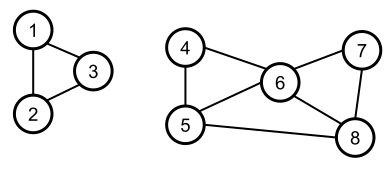
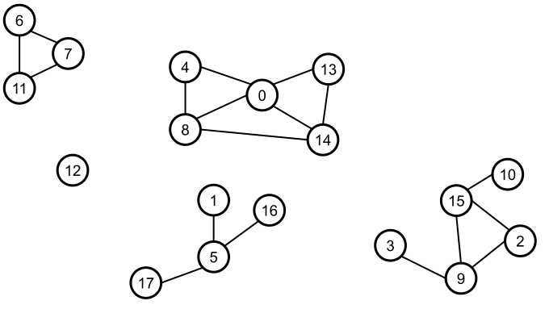

## Zusammenhangskomponenten eines Graphen

Eine Anwendung des *Depth-First Search* Algorithmus (DFS) ist die Bestimmung der Zusammenhangskomponenten eines Graphen.
Dazu benötigen wir zunächst einige Begriffe:

**Definition**: Ein (ungerichteter) Graph heißt *zusammenhängend*, wenn es von jedem Knoten
*n*<sub>1</sub> zu jedem anderen Knoten *n*<sub>2</sub> mindestens einen Pfad gibt.

Und noch eine zweite Definition:

**Definition**: Ein maximal zusammenhängender Zeilgraph eines (ungerichteten) Graphen heißt
*Zusammenhangskomponente* des Graphen.

Am besten betrachten wir in *Abbildung* 1 und *Abbildung* 2 zwei Graphen, um den Unterschied zwischen einem *zusammenhängenden* und nicht *zusammenhängenden*
besser zu verstehen. In *Abbildung* 1 erkennen Sie einen nicht-zusammenhängenden Graphen:



*Abbildung* 1: Beispiel eines nicht-zusammenhängenden Graphen.

Das Gegenstück eines zusammenhängenden Graphen finden Sie in *Abbildung* 2 vor:


*Abbildung* 2: Beispiel eines nicht-zusammenhängenden Graphen.

Der DFS-Algorithmus (engl. *depth-first search*) eignet sich ideal zum Suchen aller
Zusammenhangskomponenten eines Graphen. 

Eine Beschreibung befindet sich im selben Video, das den *Depth-First Search* Algorithmus erläutert:

https://www.youtube.com/watch?v=7fujbpJ0LB4  (10 Minuten).


Zum Testen ihrer Realisierung legen Sie bitte den Graphen aus der folgenden *Abbildung* 3 zugrunde:



*Abbildung* 3: Graph zum Testen des *Depth-First Search* Algorithmus.

Welchen Zusammenhangskomponenten können Sie rechnerisch bestimmen?

Das folgende Code-Fragment bietet eine Hilfestellung:

```cpp
01: UnweightedUndirectedGraphAdjListRepresentation<int> graph{ 18 };
02: 
03: graph.addEdges({
04:     {6, 7},{6, 11},{7, 11},
05:     {0, 4},{0, 8},{0, 13},{0, 14},{4, 8},{8, 14},{13, 14},
06:     {1, 5},{5, 17},{5, 16},
07:     {3, 9},{9, 15},{2, 15},{2, 9},{10, 15}
08: });
09: 
10: std::cout << graph << std::endl;
11: 
12: DFSSolver dfs{ graph };
13: dfs.computeComponents();
14: size_t count{ dfs.getNumberOfComponents() };
15: 
16: for (size_t index{}; index != count; ++index) {
17: 
18:     auto component = dfs.getComponent(index + 1);
19: 
20:     for (size_t last{}; size_t vertex : component) {
21:         std::cout << "[" << vertex << "]";
22:         if (last < component.size() - 1) {
23:             std::cout << ", ";
24:         }
25:         ++last;
26:     }
27:     std::cout << std::endl;
28: } 
```

*Antwort*:

```
[0], [4], [8], [13], [14]
[1], [5], [16], [17]
[2], [3], [9], [10], [15]
[6], [7], [11]
[12]
```


##### Bezug zur STL:

Folgende Elemente der STL können Anwendung finden:

###### Container:

`std::vector<>`, `std::deque<>`, `std::list<>`, `std::initializer_list`

###### Iteratoren:

`std::vector<int>::iterator`, `std::vector<int>::reverse_iterator`, `std::back_inserter`

###### Algorithmen:

`std::for_each`, `std::reverse`, `std::fill`, `std::generate`, `std::begin`, `std::end`, `std::tuple_size`

---

[Zurück](../../Readme.md)

---

