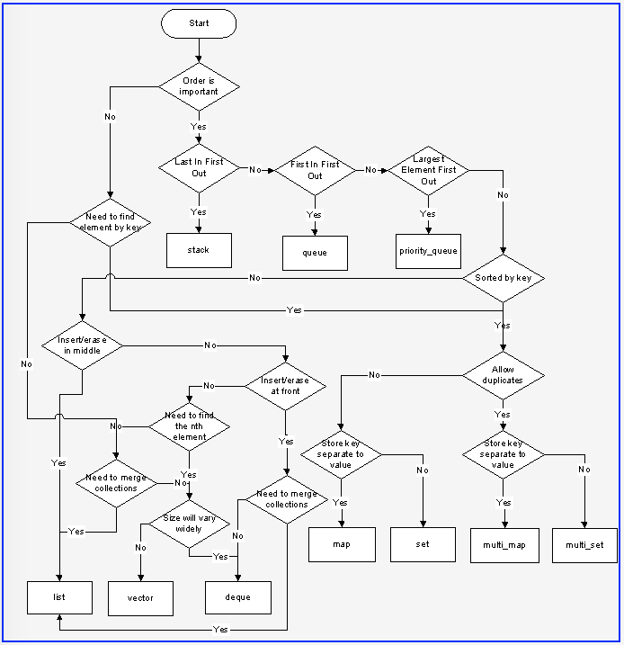

# STL Container

## Grundlagen

Ein STL-Container ist eine Sammlung von Objekten desselben Typs (die Elemente).

  * Ein Container *besitzt* die Elemente.
      * Erzeugung und Zerstörung werden vom Container gesteuert.

Man unterscheidet zwei grundlegende Arten von Behältern:

  * Sequenzielle Container
      * Der Benutzer steuert die Reihenfolge der Elemente
      * `std::vector`, `std::list`, `std::deque`
  * Assoziative Container
      * Der Container steuert die Position der darin enthaltenen Elemente
      * Auf die Elemente kann nur mit einem *Schlüssel* zugegriffen werden
      * `std::set`, `std::multiset`, `std::map`, `std::multimap`


Abbildung 1: Sequenzielle und assoziative Container.


## Allgemeine Container Konzepte

Folgende programmiersprachlichen Merkmale werden von allen Containern unterstützt:

  * Standard-Konstruktor

  * Kopier-Konstruktor und Wertzuweisung: *deep copy* Strategie

  * `swap`
      * `a.swap(b)` und `std::swap(a, b)`

  * ==, !=
      * Es wird der *Inhalt* verglichen.  Dabei müssen die Elemente im Container in derselben Reihenfolge vorliegen.

  * Vergleich der Reihenfolge

      * So genannte *lexikographische Reihenfolge*: Das erste ungleiche Element entscheidet die Reihenfolge.

         ```cpp
        std::vector<int> a{ 1, 2, 3 };
        std::vector<int> b{ 1, 3, 2 };
        assert(a < b);
         ```

  * `begin()`, `end()`

  * `size()`, `empty()`, `max_size()`

  * Instanzvariablen

      * `value_type`
      * `reference` (in Bezug auf `value_type`)
      * `const_reference`
      * `iterator`
      * `const_iterator`
      * `difference_type` (bezieht sich auf Iteratoren)
      * `size_type` (in der Regel `size_t`)

Ein reversibler Container hat zusätzlich folgende Eigenschaften:

  * `rbegin()`, `rend()`

  * Instanzvariablen

      * `reverse_iterator`
      * `const_reverse_iterator`

## Allgemeine Konzepte eines sequenziellen Containers

Gemeinsame Eigenschaften aller sequenziellen Container:

  * Konstruktoren
      * Konstruktor `Container(n, val)` füllt den Container mit `n` Kopien von `val`.
      * *Standardfüllkonstruktor* `Container(n)` füllt den Container mit `n` Defaultwerten.
      * Bereichskonstruktor `Container(i,j)` füllt Behälter mit dem Inhalt des Iterators im Bereich `[i, j)`.

  * `assign`
      * Zuweisung `(n, val)` - füllt den Container mit `n` Werten des Wert `val`.
      * Bereichszuweisung `(i, j)` - `i` und `j` stehen für Iteratoren und beschreiben einen Bereich, der zugewiesen wird.
      * alte Elemente werden zugewiesen bzw. zerstört

  * `insert`
      * `insert(pos, val)` fügt `val` unmittelbar vor der Position ein, auf die der Iterator `pos` zeigt .
      * `insert(pos, n, val)` fügt `n` Kopien ein.
      * `insert(pos, i, j)` fügt den Inhalt des Bereichs `[i, j)` ein.

  * `erase`
      * `erase(p)` löscht das Element, auf das der Iterator `p` zeigt.
      * `erase(p, q)` löscht den Bereich `[p, q)`

  * `clear`
      *  löscht alle Elemente im Container.


## Allgemeine Konzepte eines assoziativen Containers

Die assoziativen STL-Standardcontainer (`std::set` , `std::multiset` , `std::map` , `std::multimap`) ermöglichen
den Zugriff auf Elemente mit Hilfe eines Schlüssels:

  * Für `std::set` und `std::multiset` ist das Element ein eigener Schlüssel.

  * Für `std::map` und `std::multimap` sind die Elemente vom Typ `std::pair<const Key, T>`.

  * `std::pair` ist eine Standard-Templateklasse, sie ist definiert als:

    ```cpp
    template <class T, class U>
    struct pair {
      T first;
      U second;
    
      // some constructors
    };
     ```

  * `std::set` und `std::map` enthalten höchstens ein Element zu einem Schlüssel.

  * `std::multiset` und `std::multimap` können mehrere Elemente desselben Schlüssels enthalten.

  * Die zugrunde liegende Datenstruktur ist ein ausgewogener Suchbaum (*balanced search tree*):

    * logarithmische Zugriffszeit
    * Iteration erfolgt in der Reihenfolge der Schlüsselwerte


## Überblick über alle STL-Container

### Sequenzielle Container

| STL-Container | Beschreibung |
|:-------------- |:-----------------------------------------|
| `std::array` | statisches zusammenhängendes Array |
| `std::vector` | dynamisches zusammenhängendes Array |
| `std::deque` | *double-ended queue* (Warteschlange)  |
| `std::forward_list` | einfach verknüpfte lineare Liste |
| `std::list` | doppelt verknüpfte lineare Liste |

Tabelle 1. Sequenzielle Container.


### Assoziative Container

| STL-Container | Beschreibung |
|:-------------- |:-----------------------------------------|
| `std::map` | Sammlung von Paaren von Schlüsseln und Werten |
| `std::set` | Sammlung von Schlüsseln (Werten), Menge |
| `std::multimap` | Wie `std::map`, derselbe Schlüssel kann mehrmals vorhanden sein |
| `std::multiset` | Wie `std::set`, Schlüssel können mehrfach vorkommen |

Tabelle 2. Assoziative Container.

*Bemerkung*: Die Container aus Tabelle 2 speichern ihre Elemente intern in einem ausgeglichenen BST (*"binary search tree"*).
Man kann folglich sagen, dass die Elemente sortiert (Schlüssel) gespeichert sind.


### Ungeordnete assoziative Container

| STL-Container | Beschreibung |
|:-------------- |:-----------------------------------------|
| `std::unordered_map` | Wie `std::map`, nur eben unsortiert |
| `std::unordered_set` | Wie `std::set`, nur eben unsortiert |
| `std::unordered_multimap` | Wie `std::multimap`, nur eben unsortiert |
| `std::unordered_multiset` | Wie `std::multiset`, nur eben unsortiert |

Tabelle 3. Ungeordnete assoziative Container.

*Bemerkung*: Die Container aus Tabelle 3 speichern ihre Elemente intern in einer Hash-Tabelle.
Man kann folglich sagen, dass die Elemente nicht in sortierter Reihenfolge vorliegen, sondern in einer beliebigen
Reihenfolge abgelegt sind.


### Containeradapter

| STL-Container | Beschreibung |
|:-------------- |:-----------------------------------------|
| `std::stack` | LIFO Datenstruktur (*"last in - first out"*) |
| `std::queue` | FIFO Datenstruktur (*"fast in - first out"*) |
| `std::priority_queue` | Passt einen `std::queue`-Container an die Prinzipien einer Prioritätswarteschlange an |

Tabelle 4. Containeradapter.

*Bemerkung*: Ein Containeradapter definiert - basierend auf einer vorhandenen Containerschnittstelle - eine neue
Schnittstelle, die gegenüber dem zugrunde liegenden Container stark eingeschränkt ist. Insbesondere besitzen
Containeradapter *keine* Iteratoren. Der Zugriff auf seine Elemente ist deshalb nur über Methoden des
Adapterobjekts möglich.

*Bemerkung*: Ein `std::priority_queue`-Objekt verhält sich ähnlich wie ein `std::queue`-Objekt, allerdings
mit dem Unterschied, dass die eingefügten Elemente gemäß ihrer Priorität an die Spitze der Warteschlange
gelangen, wo sie dann beim nächsten Zugriff entfernt werden. Es wird also immer das Element entfernt,
das die jeweils höchste Priorität besitzt. Elemente mit gleicher Priorität werden in der Reihenfolge entfernt,
in der sie eingefügt wurden.

### `std::span`

| STL-Container | Beschreibung |
|:-------------- |:-----------------------------------------|
| `std::span` | Ein `std::span`-Objekt ist eine Ansicht (*View*) über eine zusammenhängende Folge von Objekten, deren Speicher einem anderen Objekt gehört. |

Tabelle 5. Erweiterungen in C++ 20.


## C++ Cheat Sheet

Zu STL Containern findet sich im Internet ein Cheat Sheet, dass ich Ihnen an dieser Stelle nicht vorenthalten möchte:



Abbildung 2: Ein Cheat Sheet zu STL Containern.

---

[Zurück](Readme.md)

---

