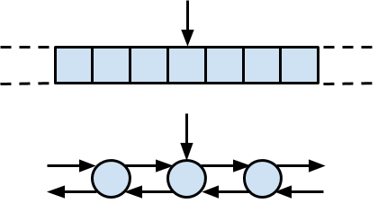
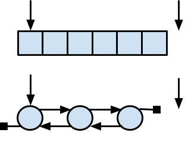

# STL Iteratoren

## Grundlagen

### Sequentielle Suche

Betrachten Sie einen einfachen Algorithmus `std::find`:

  * Suche einen bestimmten Wert in einer Sequenz (lineare Ansammlung von Elementen).
  * Suche von Anfang an, bis der Wert gefunden wurde oder das Ende erreicht ist.

Als eine Art abstrakter Algorithmus ist diese Formulierung klar, aber können wir diesen Algorithmus so implementieren,
ohne festzulegen, um welche Art von Sequenz es sich handelt?

Jede Implementierung muss folgende Fragen beantworten:

  * Wie wird der Beginn der Sequenz angegeben?
  * Wie bewege ich mich in der Sequenz vorwärts?
  * Woran erkennt man das Ende der Sequenz?
  * Wie greife ich auf ein Element der Sequenz zu?
  * Was ist der Rückgabewert für den Erfolg?
  * Was ist der Rückgabewert bei einem Fehler?

*Iteratoren* bieten eine elegante Antwort auf all diese Fragen.

### Iteratoren

Unter einem *Iterator* verstehen man einen verallgemeinerten Zeiger,
der eine Position in einem Container identifiziert.



Abbildung 1: Versuch der Visualisierung eines Iterators.

Er ermöglicht das Bewegen im Container (`operator++`) und den Zugriff auf Elemente (`operator*`).

Es folgen die Antworten auf obige Fragen:

  * Wie wird der Beginn der Sequenz angegeben? Durch einen Iterator zum Anfang der Sequenz.
  * Wie bewege ich mich in der Sequenz vorwärts? `operator++`
  * Woran erkennt man das Ende der Sequenz? Durch einen Iterator zum Ende der Sequenz.
  * Wie greife ich auf ein Element der Sequenz zu? `operator*`
  * Was ist der Rückgabewert für den Erfolg? Iterator zeigt auf die gefundene Position.
  * Was ist der Rückgabewert bei einem Fehler? Durch einen Iterator in Bezug auf die Position nach dem Ende der Sequenz.

### Bereiche

Ein *Bereich* ist die Standard-STL-Methode zum Definieren einer Sequenz.
Die meisten STL-Algorithmen verwenden einen Bereich als Argument.

  * Ein Bereich ist ein Paar von Iteratoren, das auf den Anfang und das Ende der Sequenz zeigen.
  * Der Anfangs-Iterator zeigt auf das erste Element, der Ende-Iterator auf die Position, die einen Schritt *hinter* dem letzten Element liegt.



Abbildung 2: Markierung von Anfang und Ende eines Bereichs.

  * Der Bereich wird oft als halboffener Bereich `[begin,end)` oder `[first,last)` oder `[first,beyond)` bezeichnet.
  * Ein Bereich `[begin,end)` ist *gültig*, wenn `end` durch wiederholte Anwendung des Aufrufs von `operator++` vom Anfang aus betrachtet erreichbar ist.

Auch wenn es auf den ersten Blick etwas überrascht, aber die Asymetrie von `[begin,end)`
hat durchaus ihre Vorteile:

  * `[iter, iter)` ist der leere Bereich.
  * Die Länge von `[begin,end)` ist `end - begin`.
  * `[A, A + N)` ist der Bereich des Arrays `int A [N];`
  * `end` kann verwendet werden, um einen Suchfehler zu signalisieren.
  * Schleifen über alle Elemente eines Bereichs lassen sich einfach formulieren:

```cpp
for (iter = begin; iter != end; ++iter) {
  // do something with *iter
}
```

oder

```cpp
while (begin != end) {
  // do something with *begin
  ++begin;
}
```

In den modernen Erweiterungen von C++ kann man diese Iteration auch unter Einbeziehung
des Containers mit der so genannten `range-based loop` formulieren:

 ```cpp
for (int n : container) {
    // do something with n
} 
```

Diese Schreibweise lässt allerdings das Iteratoren-Konzept außer Acht, nur um es angesprochen zu haben.

## Kategorien

Die Iteratoren lassen sich in Kategorien einteilen. Die folgende Abbildung zeigt die fünf von der Standardbibliothek
definierten Iteratorkategorien und ihre hierarchische Beziehung. Da die Iteratorkategorien der Standardbibliothek
hierarchisch sind, enthält jede Kategorie alle Methoden/Operatoren der darüber liegenden Kategorien:


Abbildung 3: Einteilung der Iteratoren in Kategorien.

Der folgenden Tabelle können Sie entnehmen, welcher STL-Container welchen Iterator-Typ unterstützt:

| STL-Container | Iterator-Kategorie |
|:-------------- |:-----------------------------------------|
| `std::vector` | Random Access |
| `std::list` | Bidirectional |
| `std::deque` | Random Access  |
| `std::map` | Bidirectional |
| `std::multimap` | Bidirectional |
| `std::set` | Bidirectional |
| `std::multiset` | Bidirectional |
| `std::stack` | No Iterator supported |
| `std::queue` | No Iterator supported |
| `std::priority_queue` | No Iterator supported |

Tabelle 1. STL-Container und die von ihnen unterstützte Iterator-Kategorie.

Auch lassen sich die unterstützten Operatoren eines Iterators in Bezug auf seine Kategorienzugehörigkeit
tabellarisch auflisten:

| Iterator | Access | Read | Write | Iterate | Comparison |
|:-------- |:-------|:-----|:------|:--------|:-----------|
| Input | `->` | `= *it` |    | `++` | `==`, `!=` |
| Output  |    |   |  `*it =`  | `++` |  |
| Forward  | `->` | `= *it` | `*it =`   | `++` | `==, !=` |
| Bidirectional  |   | `= *it` |  `*it =`  | `++`, `--` | `==`, `!=` |
| Random Access | `->`, `[]` | `= *it` |  `*it =`  | `++`, `--`, `+=`, `-=`, `+`, `-` | `==`, `!=`, `<`, `<=`, `>`, `>=` |

Tabelle 2. STL Iterator-Kategorien und die von ihnen unterstützten Operatoren.

---

[Zurück](../../Readme.md)

---

